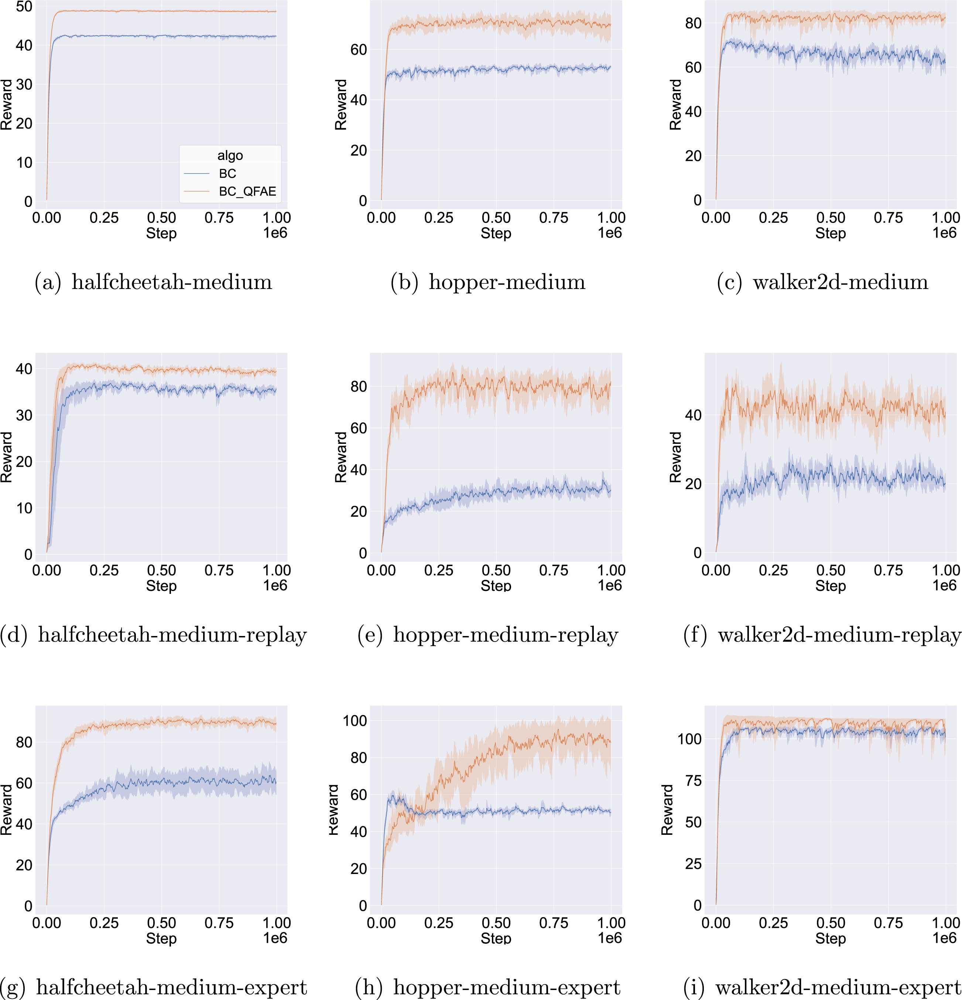

# QFAE (Q-Function guided Action Exploration)
This repository contains the source code for "QFAE: Q-Function guided Action Exploration for offline deep reinforcement learning"

## Getting started
QFAE is evaluated on MuJoCo continuous control tasks in OpenAI gym. It is trained using PyTorch 1.13.1+cu117 and Python 3.9.
```bash
# install pytorch and other lib
conda install pytorch==1.13.1 torchvision==0.14.1 torchaudio==0.13.1 pytorch-cuda=11.7 -c pytorch -c nvidia
pip install -r requirements.txt
```
## Method
To efficiently and effectively tackle the suboptimality of offline data, we aim to improve the data quality from the perspective of action exploration. Theoretically, we analyze the impact of action exploration on the policy’s cumulative rewards. We observe that introducing a small perturbation to the offline data can enhance the learned policy compared to the original data. Specifically, QFAE involves two main steps: first perturbing actions in the offline dataset with Q-function guidance, and then using these perturbed actions to improve the policy of the offline RL algorithm. 

## Dataset
Our experiment is based on [D4RL](https://github.com/berkeley-rll/d4rl)

## Running the code

```
python run_experiment.py --configs  configs/halfcheetah-medium-v2.yaml
```

## Result


